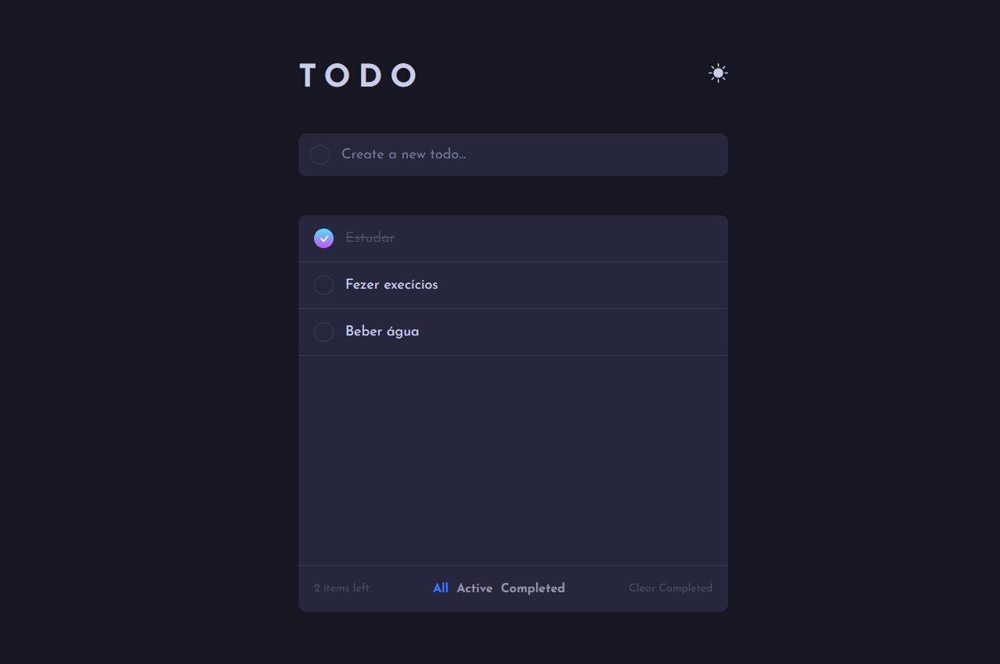

<h1 align="center">To Do</h1>

O objetivo do projeto era criar uma lista de tarefas, os dados estão sendo salvos em local storage. 

### 🔗 Links

- URL do site no ar: [Clique aqui!](https://matheuscmorais356.github.io//)

### 🛠 Tecnologias

As seguintes ferramentas foram usadas na construção do projeto:

- HTML
- CSS
- JavaScript
- ReactJS

### Autor
---

Feito por Matheus Cardoso Morais 👋🏽 Entre em contato!

 

